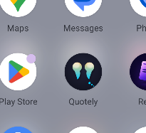
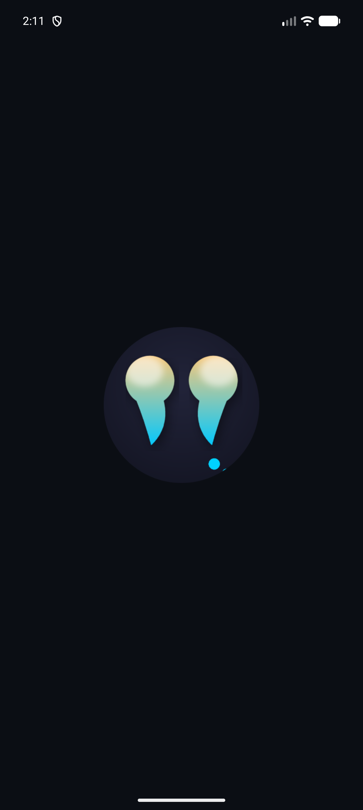
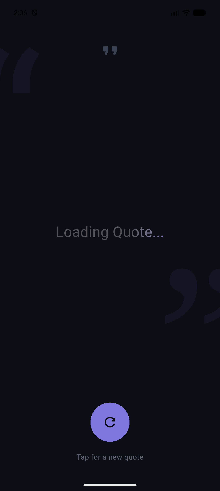
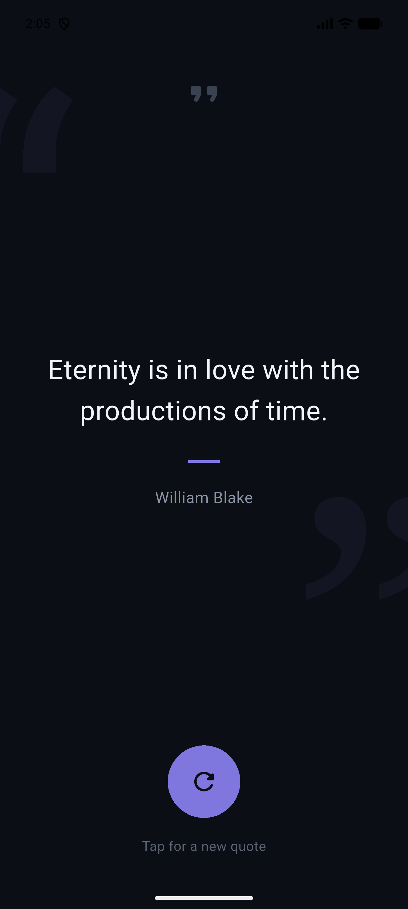

<div align="center">

<h1>💬 Quotely</h1>

<p>
  <a href="https://flutter.dev">
    
  </a>
  <a href="https://dart.dev">
    
  </a>
  <a href="LICENSE">
    
  </a>
  <a href="https://flutter.dev">
    
  </a>
</p>

<p><strong>A minimal, dark-themed Flutter app that delivers a fresh random quote with a single tap — built with Cubit state management and a clean, layered project structure.</strong></p>

<p>
  <a href="#-demo-video">🎬 Demo Video</a> • 
  <a href="#-features">✨ Features</a> • 
  <a href="#-screenshots">📸 Screenshots</a> • 
  <a href="#-architecture">🏗️ Architecture</a> • 
  <a href="#-getting-started">🚀 Getting Started</a> • 
  <a href="#-author">👤 Author</a>
</p>

</div>

---

<div align="center">

## 🎬 Demo Video

### 📱 Watch Quotely in Action

**[▶️ Watch Demo](YOUR_DEMO_LINK_HERE)**

*A quick showcase of the loading shimmer, quote transitions, and the refresh interaction.*

</div>

---

<div align="center">

## 📖 Overview

</div>

**Quotely** is a lightweight Flutter application that fetches and displays a random quote — along with its author — from the [API Ninjas Quotes API](https://api.api-ninjas.com/v2/randomquotes). It focuses on a calm, minimal dark interface with a single primary action: tap to get a new quote. Built with Cubit for predictable state management and organized into a scalable `core` / `features` folder structure.

---

<div align="center">

## ✨ Features

</div>

### 🎯 Core Features
- **One-Tap Random Quote** 🔄 Fetches a brand-new quote and author on every tap
- **Shimmer Loading State** ✨ Animated shimmer placeholder while the quote is being fetched
- **Smooth Transitions** 🎞️ `AnimatedSwitcher` fade between quotes for a polished feel
- **Friendly Error Handling** ⚠️ Clear, centered error message on network/server failure
- **Cache-Busted Requests** 🕓 Timestamp query parameter ensures a fresh quote every time (no stale caching)
- **Minimal Dark UI** 🌙 Custom dark palette with subtle oversized quotation-mark watermarks in the background

### 🛠️ Technical Highlights
- **Layered Project Structure** 🏗️ Separation between `core` (shared) and `features/home` (feature-specific: data / logic / ui)
- **BLoC (Cubit) State Management** 🧠 4 predictable states — `Initial`, `Loading`, `Loaded`, `Error`
- **Retrofit + Dio Networking** 🌐 Type-safe REST client generated from an abstract API definition
- **Secure API Key Handling** 🔐 API key loaded at runtime from a `.env` file via `flutter_dotenv` (not hardcoded)
- **JSON Serializable Models** 📦 Auto-generated `fromJson`/`toJson` via `json_serializable`
- **Responsive UI** 📐 `flutter_screenutil` for consistent sizing across devices
- **Native Splash & Launcher Icons** 📱 Configured splash screen and adaptive launcher icon

---

<div align="center">

## 📸 Screenshots

</div>

<div align="center">

| 🎯 App Icon | 🚀 Splash Screen | ⏳ Loading State | 💬 Quote Loaded |
|:-----------:|:-----------------:|:-----------------:|:-----------------:|
|  |  |  |  |
| Quotely on your home screen | Dark launch screen | Shimmer while fetching | Quote + author displayed |

</div>

---

<div align="center">

## 🛠️ Technical Stack

</div>

<div align="center">

| Component | Technology | Purpose |
|:---------:|:----------:|:-------:|
| **Framework** | Flutter | Cross-platform UI |
| **Language** | Dart (SDK ^3.12.1) | Core development |
| **HTTP Client** | Dio ^5.10.0 | Underlying HTTP client |
| **API Layer** | Retrofit ^4.9.2 / retrofit_generator ^10.2.7 | Type-safe REST client generation |
| **State Management** | flutter_bloc (Cubit) ^9.1.1 | Predictable state handling |
| **Screen Adaptation** | flutter_screenutil ^5.9.3 | Responsive sizing |
| **JSON Parsing** | json_annotation / json_serializable ^6.14.0 | Model serialization |
| **Env Variables** | flutter_dotenv ^6.0.1 | Secure API key loading |
| **Loading Effect** | shimmer ^3.0.0 | Animated loading placeholder |
| **Logging** | pretty_dio_logger ^1.4.0 | HTTP request/response logging |
| **API** | API Ninjas — Quotes v2 | Random quote & author data |
| **Splash Screen** | flutter_native_splash ^2.4.8 | Native launch screen |
| **Launcher Icons** | flutter_launcher_icons ^0.14.4 | App icon generation |
| **Rename Tool** | rename ^3.1.0 | Bundle ID / app name management |

</div>

---

<div align="center">

## 🏗️ Architecture

</div>

### 📁 Project Structure

```
lib/
├── main.dart                              # App entry point (.env load, ScreenUtilInit, routing)
│
├── core/                                  # 🌐 Shared, feature-agnostic code
│   ├── constants/
│   │   ├── api_constants.dart             # Base URL, endpoint path, API key getter
│   │   └── app_constants.dart             # Route name constants
│   ├── helpers/
│   │   ├── routing_extension.dart         # BuildContext navigation extension
│   │   └── spacing.dart                   # Reusable SizedBox spacing helpers
│   ├── networking/
│   │   └── dio_factory.dart               # Dio instance with base options & logging interceptor
│   ├── routing/
│   │   └── app_router.dart                # onGenerateRoute + Cubit/dependency injection
│   └── theming/
│       └── app_colors.dart                # App-wide dark color palette
│
└── features/
    └── home/                               # 🏠 Home / random-quote feature
        ├── data/
        │   ├── models/
        │   │   ├── quote_model.dart        # QuoteModel (quote, author)
        │   │   └── quote_model.g.dart      # Generated JSON (de)serialization
        │   ├── repo/
        │   │   └── home_repo.dart          # Bridges Cubit and Webservices
        │   └── webservices/
        │       ├── webservices.dart        # Retrofit abstract API definition
        │       └── webservices.g.dart      # Generated Retrofit client
        ├── logic/
        │   ├── quote_cubit.dart            # Fetch logic & state emission
        │   └── quote_state.dart            # Initial / Loading / Loaded / Error states
        └── ui/
            ├── widgets/
            │   ├── new_quote_button.dart   # Circular refresh button + hint label
            │   └── quote_content.dart      # Shimmer / quote / author display
            └── home_screen.dart            # Screen composition & BlocBuilder
```

### 🔄 Data Flow

```
┌──────────────┐     ┌──────────────┐     ┌──────────────┐     ┌──────────────┐     ┌──────────────┐
│  HomeScreen  │◄────│  QuoteCubit  │◄────│  HomeRepo    │◄────│ Webservices  │◄────│ API Ninjas   │
│  (UI/Widgets)│     │   (State)    │     │  (Bridge)    │     │  (Retrofit)  │     │ (randomquotes)│
└──────────────┘     └──────────────┘     └──────────────┘     └──────────────┘     └──────────────┘
                                                                        │
                                                                        ▼
                                                                 ┌──────────────┐
                                                                 │  QuoteModel  │
                                                                 │ (fromJson)   │
                                                                 └──────────────┘
```

### 🧠 State Management

`QuoteCubit` extends `Cubit<QuoteState>` and exposes a single method, `getRandomQuote()`, which:

1. Emits `QuoteLoading()` immediately.
2. Calls `HomeRepo.getRandomQuote()`, which requests `GET /v2/randomquotes` with the `X-Api-Key` header and a `t` (timestamp) query parameter to avoid cached responses, then returns the first item of the returned list.
3. On success → emits `QuoteLoaded(quote)`.
4. On `DioException` → emits `QuoteError("There is a problem with the network or the server.")`.
5. On any other exception → emits `QuoteError('There is a problem.')`.

`HomeScreen` listens via `BlocBuilder<QuoteCubit, QuoteState>`: it renders the error message directly for `QuoteError`, and delegates `Initial` / `Loading` / `Loaded` to `QuoteContent`, which shows a shimmer placeholder while loading and an animated quote + author once loaded.

### 🎨 Color Palette

| Token | Hex | Usage |
|:-----:|:---:|:------|
| `background` | `#0B0E14` | Screen background |
| `quoteText` | `#F2F4F8` | Main quote text |
| `authorText` | `#8B93A5` | Author name |
| `accent` | `#7F77DD` | Refresh button, divider, shimmer highlight |
| `hintText` | `#5B6373` | "Tap for a new quote" hint |
| `quoteIcon` | `#3A4252` | Top quote icon |

---

<div align="center">

## 📱 Native Configuration

</div>

### Launcher Icons (`flutter_launcher_icons.yaml`)
```yaml
flutter_launcher_icons:
  android: "launcher_icon"
  ios: true
  image_path: "assets/app_icon.png"
  min_sdk_android: 21
  adaptive_icon_background: "#030114"
  adaptive_icon_foreground: "assets/app_icon.png"
  adaptive_icon_foreground_inset: 10
```

### Splash Screen (`flutter_native_splash.yaml`)
```yaml
flutter_native_splash:
  color: "#0B0E14"
  image: assets/app_icon.png
  android_12:
    color: "#0B0E14"
    image: assets/app_icon.png
```

---

<div align="center">

## 📦 Dependencies

</div>

```yaml
dependencies:
  flutter:
    sdk: flutter
  cupertino_icons: ^1.0.9
  # Networking
  dio: ^5.10.0
  retrofit: ^4.9.2
  retrofit_generator: ^10.2.7
  pretty_dio_logger: ^1.4.0
  # UI & Screen
  flutter_screenutil: ^5.9.3
  shimmer: ^3.0.0
  # Env variables
  flutter_dotenv: ^6.0.1
  # State Management
  flutter_bloc: ^9.1.1
  # Native Config
  flutter_native_splash: ^2.4.8
  flutter_launcher_icons: ^0.14.4
  rename: ^3.1.0

dev_dependencies:
  flutter_test:
    sdk: flutter
  flutter_lints: ^6.0.0
  json_serializable: ^6.14.0
  build_runner: ^2.15.1
```

```bash
flutter pub get
```

---

<div align="center">

## 🚀 Getting Started

</div>

### 📋 Prerequisites

| Requirement | Version | Purpose |
|:-----------:|:-------:|:-------:|
| Flutter SDK | Compatible with Dart ^3.12.1 | Framework |
| Dart SDK | ^3.12.1 | Language |
| API Ninjas Key | Free key | Quote data ([get one here](https://api.api-ninjas.com/)) |

### ⚙️ Installation

```bash
# 1. Clone the repository
git clone https://github.com/ahmed-el-bialy/CodeAlpha_Quotely_RandomQuoteApp.git
cd CodeAlpha_Quotely_RandomQuoteApp

# 2. Install dependencies
flutter pub get

# 3. Generate JSON serializable & Retrofit code
flutter pub run build_runner build --delete-conflicting-outputs

# 4. Create your .env file at the project root (see .env.example)
cp .env.example .env
# then open .env and set:
# API_KEY=your_api_key_here

# 5. Run the app
flutter run

# Build for production
flutter build apk --release      # Android
flutter build ios --release      # iOS
```

> **Note:** The `.env` file is declared as a Flutter asset in `pubspec.yaml`, so it must exist at the project root before running the app, or `dotenv.load()` in `main.dart` will fail.

---

<div align="center">

## ⚠️ Known Limitations

</div>

| Issue | Details | Status |
|:------|:--------|:------:|
| Errors logged via `print` | `QuoteCubit` uses `print()` for error logging instead of a structured logger | 🔧 Planned |
| No offline mode | Requires an active internet connection | 🔧 Planned |
| No quote history/favorites | No persistence between sessions | 🔧 Planned |
| No localization | English only | 🔧 Planned |

---

<div align="center">

## 🗺️ Roadmap

</div>

- [ ] Replace `print` error logging with a structured logger
- [ ] Add "save to favorites" & local persistence (Hive/SharedPreferences)
- [ ] Share quote as image/text
- [ ] Localization (Arabic, English)
- [ ] Unit & widget tests
- [ ] Improved accessibility (screen reader support)

---

<div align="center">

## 🤝 Contributing

</div>

Contributions are welcome!

1. **Fork** the repo
2. **Create** a branch: `git checkout -b feature/your-feature`
3. **Commit**: `git commit -m 'Add awesome feature'`
4. **Push**: `git push origin feature/your-feature`
5. **Open** a Pull Request

---

<div align="center">

## 📄 License

</div>

This project is licensed under the **MIT License** — see [LICENSE](LICENSE) for details.

---

<div align="center">

## 👤 Author

</div>

**Ahmed El-Bialy**
*Flutter Developer | Mobile App Specialist*

<div align="center">

<p>
  <a href="https://www.linkedin.com/in/ahmedel-bialy/">
    
  </a>
  <a href="mailto:ah.elbialy.dev@gmail.com">
    
  </a>
  <a href="tel:+201022121573">
    
  </a>
  <a href="https://github.com/ahmed-el-bialy">
    
  </a>
</p>

<p>
  📧 <strong>Email:</strong> ah.elbialy.dev@gmail.com<br>
  📱 <strong>Phone:</strong> +20 102 212 1573
</p>

</div>

---

<div align="center">

### ⭐ Star this repo if you found it helpful!

**Built with 💙 by Ahmed El-Bialy**

</div>
